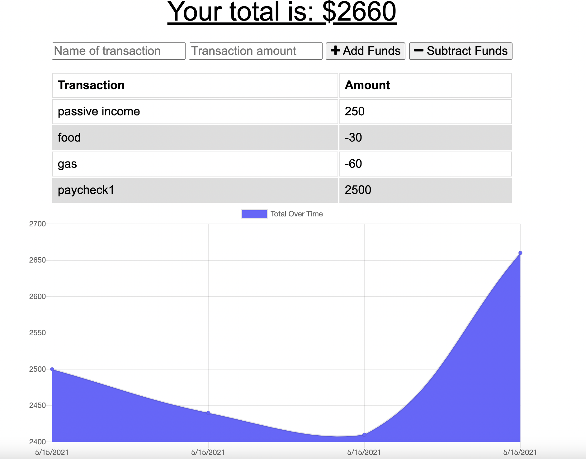
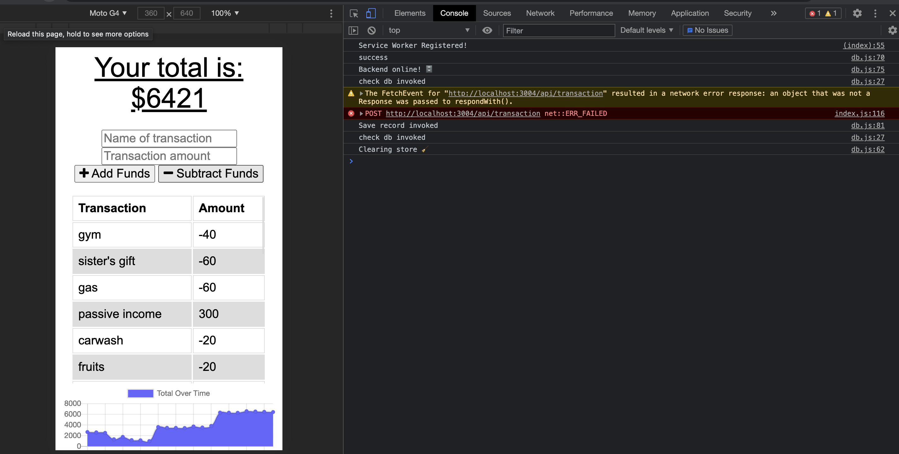

## PWA-budgetTracker

The user will be able to add expenses and deposits to their budget with or without a connection. When entering transactions offline, they should populate the total when brought back online.

Offline Functionality:

  * Enter deposits offline

  * Enter expenses offline

When brought back online:

  * Offline entries should be added to tracker.

## User Story
AS AN avid traveller
I WANT to be able to track my withdrawals and deposits with or without a data/internet connection
SO THAT my account balance is accurate when I am traveling

## Business Context

Giving users a fast and easy way to track their money is important, but allowing them to access that information anytime is even more important. Having offline functionality is paramount to our applications success.
 

 
The following image shows the console after losing connection. Transactions were added the the tracker while without connection with zero problems.

 

## Deployed app
<a href=""> click here </a>

## Contact information 

for any clarification or questions, contact me! email: dyylancasanova17@gmail.com  
if you would like to help me make this application better, please feel free to do a pull request.
GitHub: Dylan-Casanova
